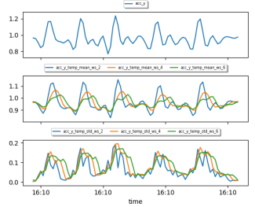
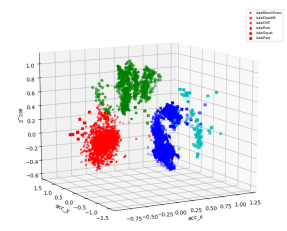
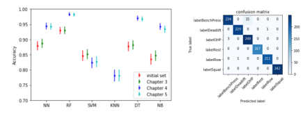

# Fitness Tracker Project

## How to use this project
To set up and run the project, follow the steps below:

### 1. Clone the Repository

First, clone this repository to your local machine:

```bash
git clone https://github.com/your-username/fitness-tracker.git
cd fitness-tracker
```

### 2. Create the environment
```bash
conda env create -f environment.yml
```

## Description

This project analyzes raw data collected from accelerometer sensors attached to a wristband. The goal is to identify exercise patterns through data processing and subsequent visual analysis. The data has been processed to remove noise and maximize the useful information for predicting repetitive movements and classifying different types of exercises.

## Dataset

The dataset contains a total of **69,677 entries**, each with a timestamp (epoch) and the **x, y, z** acceleration values from the sensor. The raw data was split across multiple files, each with a unique timestamp, so the data had to be aggregated to create a complete dataset.

### Preprocessing

To minimize information loss during aggregation, a time interval of **∆t = 0.20 s** (five samples per second) was chosen. Numerical values were aggregated using the **mean**, while categorical attributes (such as labels) were aggregated using the **mode**.

This aggregation provided a solid foundation for data visualization, where unique patterns in different exercises were evident. For example, in visualizations of accelerometer data for heavy exercise sets, the peaks clearly identified the repetitions of the movements. Additionally, when comparing medium and heavy squat sets, we observed that medium-weight sets had higher peaks, while heavy sets showed deeper drops due to the heavier load.

## Data Processing

The next step was to transform the data to filter out subtle noise and extract the features that explain most of the variance in the dataset. Two approaches were implemented: **Low-Pass Filtering** and **Principal Component Analysis (PCA)**.

### Low-Pass Filter

A **Butterworth low-pass filter** was applied to remove high-frequency noise that could affect the machine learning process. This filter is particularly well-suited for temporal and periodic data, like the repetitive movements observed during exercises.

After visual inspection and iterative testing, a cutoff frequency of **1.3 Hz** was selected for the accelerometer data, as the movements had a frequency of approximately **2 seconds per repetition**.

The following equation describes the transfer function of a Butterworth low-pass filter applied to the acceleration signal:

$$
H(f) = \frac{1}{\sqrt{1 + \left(\frac{f}{f_c}\right)^{2n}}}
$$

Where:
- \( H(f) \) is the filter gain as a function of frequency.
- \( f \) is the signal frequency.
- \( f_c = 1.3 \, \text{Hz} \) is the cutoff frequency.
- \( n \) is the filter order.
### Principal Component Analysis (PCA)

To reduce the dimensionality of the dataset and focus on the features contributing the most to variability, a **Principal Component Analysis (PCA)** was conducted. PCA was applied to all features, excluding the target columns, to identify the components that best explained the variance in the dataset.

The results indicated that the first three principal components explained most of the variability. Therefore, these three components were selected and included in the final model.

The explained variance for each principal component is calculated as follows:

$$
\text{Explained variance} = \frac{\lambda_i}{\sum_{j=1}^{n} \lambda_j}
$$

Where:
- \( \lambda_i \) is the eigenvalue associated with the \(i\)-th principal component.

### Visualizations

- Shows the accelerometer data for a heavy exercise set, where the peaks clearly identify the repetitions.

.png')

## Feature Engineering

To enhance the predictive power of the dataset, additional features were derived, including aggregated features, time features, frequency features, and clusters.

### Aggregated Features

The scalar magnitude **r** of the accelerometer and gyroscope data was calculated to provide orientation-independent data. The magnitude **r** combines the x, y, and z values, and is calculated as:

$$
r_{\text{magnitude}} = \sqrt{x^2 + y^2 + z^2}
$$

This feature offers robustness to dynamic changes in device orientation.

### Time Domain Features

Time domain features were extracted by calculating the **standard deviation (sd)** and the **mean** of all numerical features, except for target columns, over different window sizes. The standard deviation captures variation over time, while the temporal mean smooths spiky noise. After testing window sizes of 2, 4, and 6 seconds, a window size of **4 seconds** was selected for the final dataset.



### Frequency Domain: Fourier Transformation

The frequency domain was explored using Fourier transformations. A **Fourier Transformation** was applied to windows of 4 seconds, generating features such as **maximum frequency**, **signal weighted average frequency**, and **power spectral entropy**. These features capture the periodicity in the data that may be overlooked in the time domain.


### Final Dataset

After feature engineering, the dataset included time and frequency domain features, aggregated features, and PCA components. Due to overlapping time windows, the resulting attributes were highly correlated. To prevent overfitting, a 50% window overlap was allowed, reducing the dataset to **4,505 instances**.

### Clustering

To capture underlying patterns, a **k-means clustering (k=4)** was performed on the acceleration data. This method produced the best silhouette score (0.6478) compared to other clustering techniques. Clustering revealed that Cluster 1 grouped most of the bench press and overhead press exercises, while Cluster 2 contained squats and Cluster 3 captured deadlifts and rows with a perfect score.



## Modeling

With the new dataset processed and feature-engineered, we proceeded to model development for classification, repetition counting, and form detection.

### Classification

The dataset was split into training and testing sets based on exercise sets. Training data included the first two sets for each exercise, weight, and participant, while test data consisted of the remaining sets. This ensured that the test data represented unseen exercise sets.

- **Feature Selection:** A forward feature selection process using decision trees identified the most important features. After 15 features, performance gains plateaued. The top 5 most predictive features were: **pca 1, acc y, pca 3, gyr x temp std ws 4, acc r pse**.

- **Regularization:** Regularization was applied to penalize more complex models, reducing overfitting. As shown in Figure 7, accuracy improved slightly with higher regularization parameters until reaching an optimal point, after which performance declined.

- **Models:** A range of models were tested, including Neural Networks, Random Forests, Support Vector Machines, K-Nearest Neighbors, Decision Trees, and Naive Bayes. Grid search was performed to tune hyperparameters for each model.

Final results

